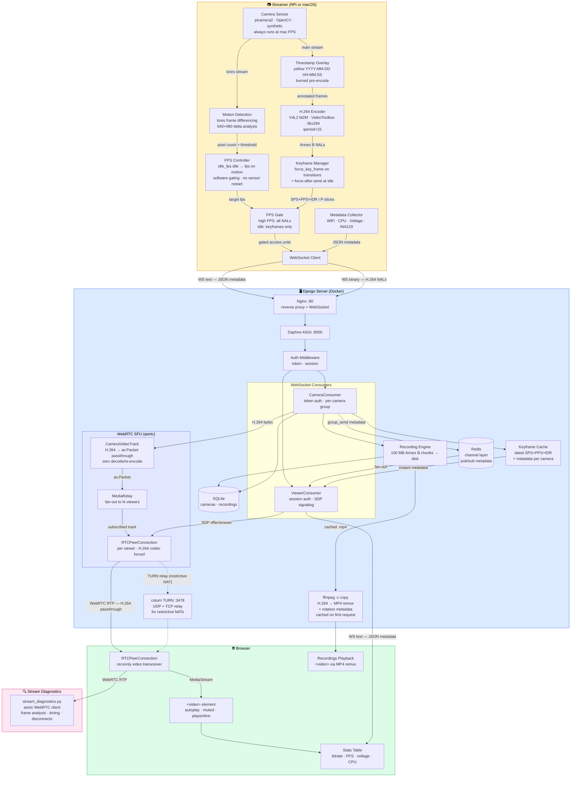

## Architecture

```mermaid
flowchart TB
    subgraph Streamer["📷 Streamer (RPi or macOS)"]
        direction TB
        CAM[Camera Sensor<br/>picamera2 · OpenCV · synthetic<br/>always runs at max FPS]
        MD[Motion Detection<br/>lores frame differencing<br/>640×480 delta analysis]
        TS[Timestamp Overlay<br/>yellow YYYY-MM-DD HH:MM:SS<br/>burned pre-encode]
        ENC[H.264 Encoder<br/>V4L2 M2M · VideoToolbox · libx264<br/>iperiod=15]
        KF[Keyframe Manager<br/>force_key_frame on transitions<br/>+ force-after-send at idle]
        GATE[FPS Gate<br/>high FPS: all NALs<br/>idle: keyframes only]
        META[Metadata Collector<br/>WiFi · CPU · Voltage · INA219]
        FPS[FPS Controller<br/>idle_fps idle → fps on motion<br/>software gating · no sensor restart]

        CAM -->|lores stream| MD
        CAM -->|main stream| TS
        MD -->|pixel count > threshold| FPS
        FPS -->|target fps| GATE
        TS -->|annotated frames| ENC
        ENC -->|Annex B NALs| KF
        KF -->|SPS+PPS+IDR / P-slices| GATE
        GATE -->|gated access units| WS_OUT[WebSocket Client]
        META -->|JSON metadata| WS_OUT
    end

    subgraph Server["🖥️  Django Server  (Docker)"]
        direction TB
        NGX[Nginx :80<br/>reverse proxy + WebSocket]
        DAPHNE[Daphne ASGI :8000]
        AUTH[Auth Middleware<br/>token · session]

        subgraph WS["WebSocket Consumers"]
            CAMWS[CameraConsumer<br/>token auth · per-camera group]
            VIEWWS[ViewerConsumer<br/>session auth · SDP signaling]
        end

        subgraph WebRTC_SFU["WebRTC SFU (aiortc)"]
            CVT[CameraVideoTrack<br/>H.264 → av.Packet passthrough<br/>zero decode/re-encode]
            RELAY[MediaRelay<br/>fan-out to N viewers]
            PCS[RTCPeerConnection<br/>per viewer · H.264 codec forced]
        end

        TURN[coturn TURN :3478<br/>UDP + TCP relay<br/>for restrictive NATs]
        REDIS[(Redis<br/>channel layer<br/>pub/sub metadata)]
        CACHE[Keyframe Cache<br/>latest SPS+PPS+IDR<br/>+ metadata per camera]
        REC[Recording Engine<br/>100 MB Annex B chunks → disk]
        DB[(SQLite<br/>cameras · recordings)]
        FFMPEG[ffmpeg -c copy<br/>H.264 → MP4 remux<br/>+ rotation metadata<br/>cached on first request]

        NGX --> DAPHNE --> AUTH
        AUTH --> CAMWS
        AUTH --> VIEWWS
        CAMWS -->|H.264 bytes| CVT
        CVT -->|av.Packet| RELAY
        RELAY -->|subscribed track| PCS
        VIEWWS -->|SDP offer/answer| PCS
        CAMWS -->|group_send metadata| REDIS -->|fan-out| VIEWWS
        CAMWS --> CACHE
        CACHE -->|instant metadata| VIEWWS
        CAMWS --> REC --> DB
        CAMWS --> DB
    end

    subgraph Browser["🌐 Browser"]
        direction TB
        RTC[RTCPeerConnection<br/>recvonly video transceiver]
        VIDEO["&lt;video&gt; element<br/>autoplay · muted · playsinline"]
        STATS[Stats Table<br/>bitrate · FPS · voltage · CPU]
        PLAYBACK[Recordings Playback<br/>&lt;video&gt; via MP4 remux]

        RTC -->|MediaStream| VIDEO
        VIDEO --> STATS
    end

    subgraph Diagnostics["🔍 Stream Diagnostics"]
        DIAG[stream_diagnostics.py<br/>aiortc WebRTC client<br/>frame analysis · timing · disconnects]
    end

    WS_OUT -->|"WS text  — JSON metadata"| NGX
    WS_OUT -->|"WS binary — H.264 NALs"| NGX
    PCS -->|"WebRTC RTP — H.264 passthrough"| RTC
    PCS -.->|"TURN relay (restrictive NAT)"| TURN -.-> RTC
    VIEWWS -->|"WS text  — JSON metadata"| STATS
    RTC -->|"WebRTC RTP"| DIAG
    REC -->|"cached .mp4"| FFMPEG --> PLAYBACK

    style Streamer fill:#fef3c7,stroke:#d97706,color:#000
    style Server   fill:#dbeafe,stroke:#2563eb,color:#000
    style Browser  fill:#dcfce7,stroke:#16a34a,color:#000
    style Diagnostics fill:#fce7f3,stroke:#db2777,color:#000
    style WebRTC_SFU fill:#e0e7ff,stroke:#6366f1,color:#000
```